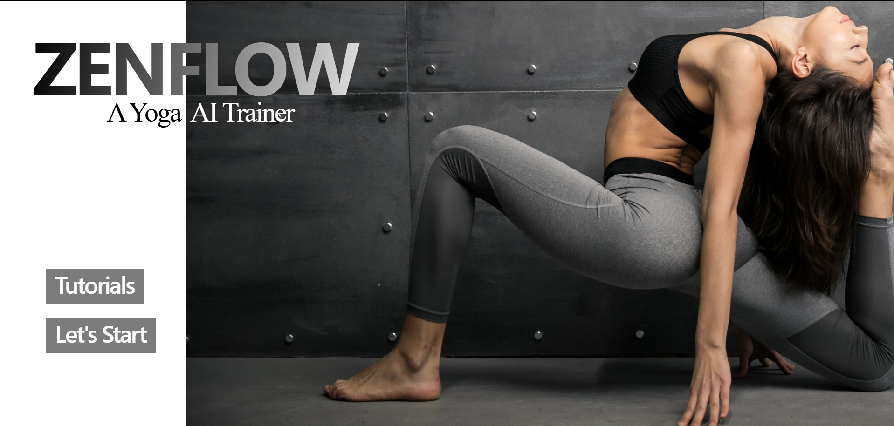
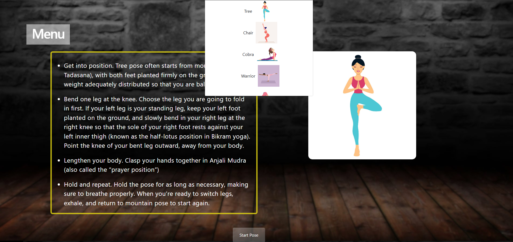
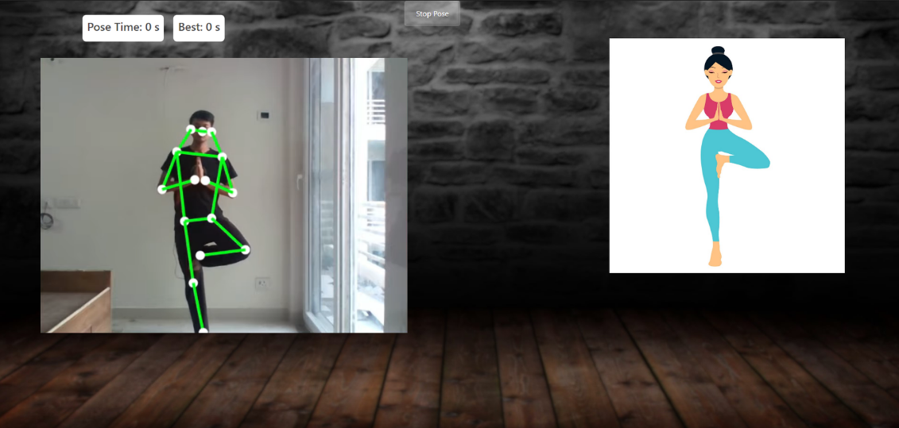

=======
# AI Yoga Assistant

A real-time, browser-based yoga instructor that uses Computer Vision to guide users through poses. The application analyzes your body posture via webcam and provides instant feedback on your alignment using geometric angle calculations.

---

## How it Works
The assistant uses a hybrid approach to ensure 99% accuracy in pose detection:
1. **Pose Estimation:** Leverages **MoveNet (Thunder)** and **MediaPipe** to detect 18 key body landmarks in real-time.
2. **Geometric Analysis:** Calculates the precise angles between joints (e.g., the angle at the knee or elbow).
3. **Verification:** Compares your live angles against "Golden Standard" pose data. If a joint is out of alignment, the app highlights the area for correction.

## Features
* **18-Point Tracking:** Tracks everything from your ankles and knees to your shoulders and ears.
* **Real-time Feedback:** Visual cues (Green/Red overlays) tell you exactly when your pose is perfect.
* **Pose Library:** Includes detailed descriptions and benefits for each yoga posture.

## Algorithm Logic: Angle Calculation
To verify a pose like **Virabhadrasana (Warrior II)**, the assistant calculates the angle $\theta$ between three points (e.g., Shoulder, Hip, and Knee) using the Law of Cosines or the Arctan2 function:

---

## Keypoints Tracked
| Index | Keypoint | Index | Keypoint |
| :--- | :--- | :--- | :--- |
| 0 | Nose | 9 | Left Wrist |
| 5 | Left Shoulder | 12 | Right Hip |
| 7 | Left Elbow | 14 | Right Knee |
| ... | ... | ... | ... |

## 💻 Tech Stack
* **Frontend:** HTML5, CSS3, JavaScript (ES6+)
* **AI Models:** TensorFlow.js, MoveNet, MediaPipe Pose
* **Math:** Vector geometry for angle verification

